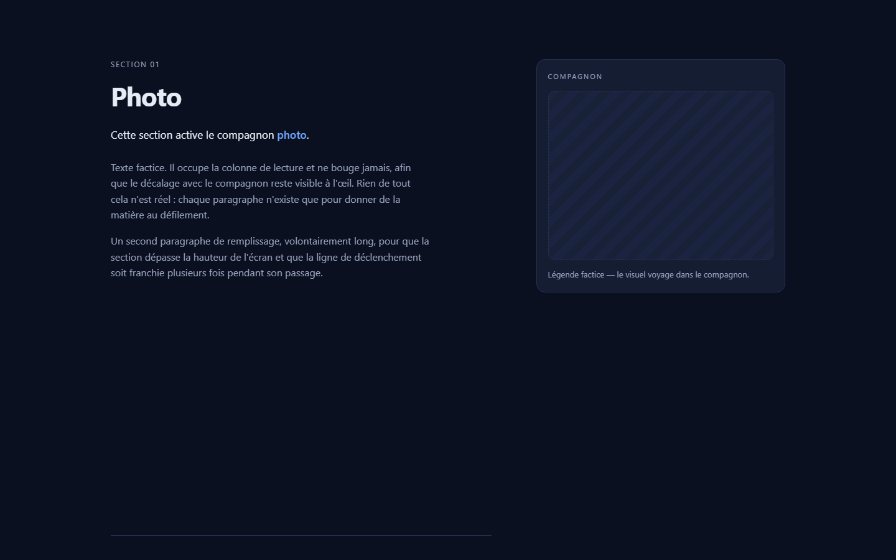
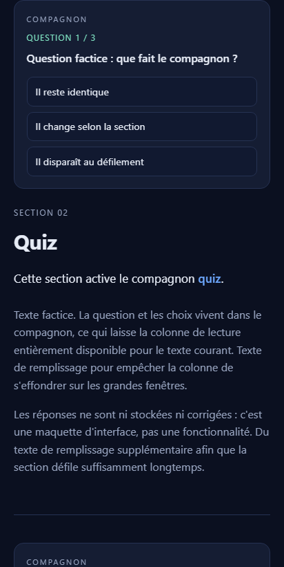

# Compagnon contextuel

Cette page montre le fonctionnement d'un **compagnon de lecture** : un panneau qui descend
la page avec vous et qui change de contenu selon la section affichée.

- **Sur grand écran et tablette**, le compagnon reste figé dans une colonne à droite, du
  début à la fin de la lecture.
- **Sur téléphone**, il n'y a plus de colonne : chaque section porte son propre compagnon,
  posé au-dessus de son texte, et il défile avec elle.

Dans les deux cas il ne masque jamais le texte, et le défilement reste entièrement natif :
rien n'est intercepté, tout se déduit de la position de la page.

Six sections de démonstration, six contenus de compagnon : une photo, un quiz, un lecteur
vidéo, une citation, des chiffres, un petit menu.


## Aperçu

**Grand écran (1440 × 900)** — le compagnon reste figé dans sa colonne, et la section 1
débute à sa hauteur.



**Téléphone (412 × 820)** — une seule colonne : le compagnon accompagne sa section dans le
flux du défilement, au-dessus de son texte.



Captures du rendu réel, prises dans le conteneur.

## Lancer la démo

```bash
docker compose up -d --build
```

Puis <http://localhost:8080>.

| Commande | Effet |
| --- | --- |
| `docker compose up -d --build` | Construction de l'image et démarrage du conteneur |
| `docker compose up -d` | Redémarrage sans reconstruction |
| `docker compose logs -f web` | Suivi des journaux |
| `docker compose ps` | État du conteneur et sonde de santé |
| `docker compose down` | Arrêt et suppression du conteneur |

## Structure

```
.
├── index.html          # Section d'ouverture, compagnon, 6 sections
├── css/style.css       # Styles, dont le comportement mobile du compagnon
├── js/app.js           # IntersectionObserver et bascule de vue
├── nginx.conf          # Configuration Nginx servie dans le conteneur
├── Dockerfile          # Image nginx:1.27-alpine
├── compose.yaml        # Service unique, port 8080 -> 80
├── .dockerignore       # Fichiers exclus du contexte de construction
├── docs/               # Captures d'écran du README
└── LICENSE             # CC BY 4.0
```

## Sections et vues

| Section | Contenu affiché dans le compagnon |
| --- | --- |
| `photo` | Emplacement photo et légende |
| `quiz` | Question factice et 3 choix |
| `video` | Lecteur vidéo dessiné, sans média réel |
| `quote` | Encadré de citation |
| `stats` | 3 chiffres clés |
| `menu` | Petit menu factice de 4 entrées |

Sur téléphone, chaque section porte en plus sa propre carte, posée au-dessus de son texte.

## Deux mises en page selon la largeur

**Tablette et ordinateur (au-dessus de 900 px)** — deux colonnes. La colonne de gauche
porte le texte, la colonne de droite porte le compagnon, qui reste figé pendant tout le
parcours. C'est la démonstration complète du motif : le compagnon ne quitte jamais l'écran
et une seule de ses vues est active à la fois.

**Téléphone (900 px et moins)** — une seule colonne, et plus rien de figé. Le compagnon
partage le flux du défilement : il est posé au-dessus de sa section, comme un bandeau
pleine largeur, puis le texte suit. Les sections 2 à 6 portent chacune leur carte
(`.companion--inline`), et le `<aside>` du début du flux sert de carte pour la première.
Le compagnon ne peut donc plus masquer la lecture, et il est toujours présent au moment
où l'on lit la section qu'il accompagne.

## Comment la section active est choisie

Le principe tient en trois points, lisibles dans `js/app.js` :

1. **Un marqueur par section.** Chaque `.section` contient un `.marker` d'un pixel placé
   tout en haut, invisible à l'écran.
2. **Un seul IntersectionObserver.** Il est configuré avec
   `rootMargin: -24% 0px -72% 0px` et `threshold: 0`, ce qui réduit la racine à une
   bande de 4 % de hauteur située entre 24 % et 28 % de la fenêtre. L'observateur sert
   uniquement de déclencheur : il réveille le code quand un marqueur entre ou sort de
   cette bande, et pas plus d'une fois par franchissement.
3. **La ligne de décision fait foi.** Au réveil, on lit la position de tous les
   marqueurs : la section active est le dernier marqueur à avoir franchi la ligne des
   24 %. Si aucun ne l'a franchie, on prend le premier qui s'en approche.

Ce découpage évite le scintillement de deux façons : la bande de 4 % crée une zone
morte où les recalculs se produisent sans changer d'état, et `applyActive()` s'interrompt
dès que l'identifiant actif n'a pas bougé. Sur un aller-retour complet de la page, la
séquence observée est exactement `photo → quiz → video → quote → stats → menu`, soit cinq
bascules pour six sections, sans allers-retours parasites.

Le défilement n'est jamais intercepté : aucun `wheel`, `touchmove` ou `scrollTo` en
JavaScript. La seule aide au clavier est l'ancre `#photo` en bas de la section
d'ouverture, qui s'appuie sur le `scroll-margin-top` natif.

## Accessibilité

- `.companion__stage` est un `aria-live="polite"` : le changement de vue est annoncé
  sans interrompre la lecture en cours.
- Les vues inactives passent par `visibility: hidden` et reçoivent `aria-hidden="true"`,
  ce qui les sort de l'arbre d'accessibilité : seule la vue active est annoncée.
- Le focus reste dans la vue visible ; les choix du quiz sont des `button` avec
  `aria-pressed`, les entrées du menu des `button` avec `aria-current`.
- `prefers-reduced-motion: reduce` fige le flottement du visuel d'ouverture, la molette
  animée de l'invitation à défiler, la transition entre vues et celle des choix.

## Notes techniques

- Image fondée sur `nginx:1.27-alpine`, fichiers statiques dans `/usr/share/nginx/html`.
- `nginx.conf` active la compression gzip, un cache de 7 jours sur les ressources et un
  repli vers `index.html` pour les adresses inconnues. Comme ce cache est long, `index.html`
  référence `css/style.css` et `js/app.js` avec un `?v=` : **remontez la version à chaque
  modification de l'un des deux**, sinon un téléphone ou un navigateur garde l'ancienne
  version et la page se trouve mêler à un HTML plus récent.
- Le compagnon figé prend la hauteur de sa vue active. Les six vues partagent la même
  cellule de grille ; les vues inactives sont repliées à `height: 0`, sinon le stage
  garderait la hauteur de la vue la plus haute et laisserait un grand vide sous les vues
  courtes (chiffres, citation). Ce repli évite aussi tout débordement.
- Les cartes de téléphone (`.companion--inline`) portent une seule vue, déjà active, et ne
  sont pas touchées par `applyActive()` : le sélecteur de `js/app.js` ne vise que le stage
  du compagnon figé. Elles sont retirées du rendu au-dessus de 900 px par `.companion--inline
  { display: none }`, si bien que la mise en page d'ordinateur ne change pas.
- La ligne de décision et la bande de détection sont exprimées en pourcentage dans deux
  fichiers : si vous les modifiez, changez `BAND_TOP` et `BAND_HEIGHT` dans `js/app.js`
  ainsi que `--band-top` et `--band-height` dans `css/style.css`.
- La sonde de santé du `Dockerfile` interroge `http://127.0.0.1/`.
- Pour changer le port publié, modifiez la ligne `ports` de `compose.yaml`.

## Licence

Ce projet est distribué sous licence **Creative Commons Attribution 4.0 International
(CC BY 4.0)**. Le texte intégral et juridiquement contraignant se trouve dans
[`LICENSE`](./LICENSE).

Vous êtes libre de :

- **Partager** — copier et redistribuer le matériau sur n'importe quel support et format
- **Adapter** — remixer, transformer et construire à partir du matériau

Sous réserve des conditions suivantes :

- **Attribution** — mentionner le créateur (le cas échéant), fournir un lien vers la
  licence et indiquer si des modifications ont été apportées
- **Pas d'indication d'endossement** — ne pas suggérer que le titulaire de la licence
  soutient ou sponsorise votre utilisation
- **Aucune restriction supplémentaire** — ne pas imposer de conditions techniques ou
  juridiques qui restreignent les droits accordés par la licence

La licence CC BY 4.0 n'est pas recommandée pour les logiciels : elle n'a pas été
approuvée par une commission de brevets.

Texte officiel : <https://creativecommons.org/licenses/by/4.0/>
